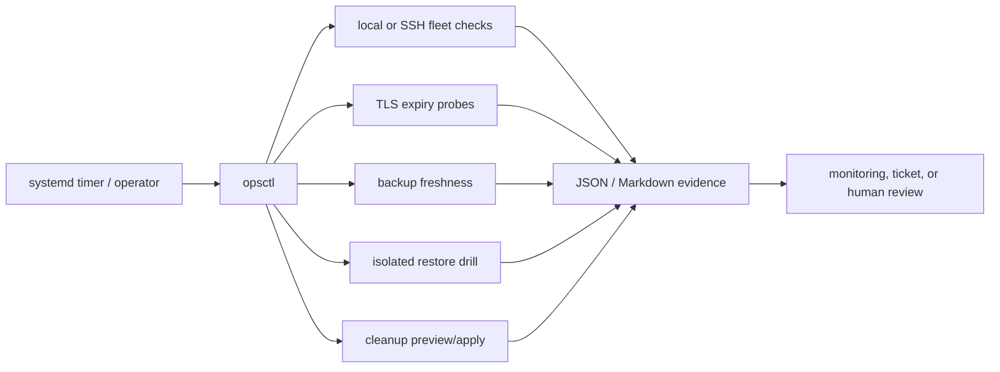

# Operations Automation Toolkit

[](https://github.com/blamixology/operations-automation-toolkit/actions/workflows/ci.yml)

A dependency-free Python toolkit for **day-two operations beyond CI/CD**: fleet health reporting, TLS certificate-expiry monitoring, backup freshness and restore verification, and guarded retention cleanup.

The repository emphasizes failure visibility and safe execution. Read-only checks are the default. Cleanup requires an explicit apply flag and confirmation token. Unreachable machines remain visible as failures instead of disappearing from the report.

## Capabilities

| Command | Automation | Safety property |
| --- | --- | --- |
| `fleet` | Runs declared checks locally or through SSH and writes a Markdown report. | After an SSH failure, remaining checks are `UNKNOWN`, never silently successful. |
| `certificates` | Probes public TLS endpoints and evaluates warning/critical expiry thresholds. | Probe and trust failures return `FAIL` with evidence. |
| `backups` | Validates backup count and newest-file age. | Reports freshness honestly; documentation states that freshness is not restore proof. |
| `restore` | Extracts the newest ZIP/TAR backup into an isolated temporary directory and checks required content. | Rejects traversal, links, excessive file counts, and expansion beyond configured limits. |
| `cleanup` | Applies age-based file-retention rules. | Dry-run by default; skips symlinks and protected patterns; apply needs exact confirmation. |

## Quick start

Requires Python 3.10 or newer. There are no runtime dependencies.

```bash
python -m unittest discover -s tests -v

python -m ops_toolkit fleet \
  --inventory config/inventory.example.json \
  --output reports/fleet-health.md

python -m ops_toolkit certificates \
  --config config/certificates.example.json

python -m ops_toolkit backups \
  --config config/backups.example.json

python scripts/create-demo-backup.py
python -m ops_toolkit restore \
  --config config/restore.example.json

python -m ops_toolkit cleanup \
  --config config/cleanup.example.json
```

Install the `opsctl` command in a virtual environment:

```bash
python -m venv .venv
. .venv/bin/activate
python -m pip install -e .
opsctl --help
```

## Applying cleanup

Preview is the default. Review the generated report before applying:

```bash
python -m ops_toolkit cleanup \
  --config /etc/ops-toolkit/cleanup.json \
  --output reports/cleanup-preview.json

python -m ops_toolkit cleanup \
  --config /etc/ops-toolkit/cleanup.json \
  --output reports/cleanup-applied.json \
  --apply --confirm DELETE_EXPIRED_FILES
```

Use a narrowly scoped service account and explicit directory permissions. Do not run cleanup as root unless the target genuinely requires it.

## Scheduling

`examples/systemd/` contains a hardened oneshot service and persistent hourly timer. Copy environment-specific inventory to `/etc/ops-toolkit`; do not store credentials or private host details in Git.

## Architecture



## Repository map

| Path | Purpose |
| --- | --- |
| `ops_toolkit/` | Dependency-free implementation and CLI. |
| `config/` | Sanitized configuration examples. |
| `tests/` | Fresh/stale, offline-host, expiry, restore-safety, protection, and deletion assertions. |
| `examples/systemd/` | Scheduling and service-hardening example. |
| `docs/safety-model.md` | Trust boundaries, failure states, and production gaps. |

## Deliberate production gaps

- Archive restore drills prove safe extraction and expected file presence, not application-level or database-level recovery. Add an environment-specific restore plus integrity/smoke checks for production assurance.
- SSH fan-out is sequential for clarity. A large fleet needs bounded concurrency, jitter, and rate limits.
- Certificate probes use the operating system trust store; private trust stores and revocation are environment-owned concerns.
- Notification and ticket integrations are omitted so credentials and vendor coupling stay outside the reference core.
- Cleanup does not remove directories and deliberately refuses implicit mutation.

## Operating model

The four commands share one operating model: explicit scope, read-only defaults, observable partial failure, guarded mutation, machine-readable exit status, and tests for unhappy paths.

## License

MIT
